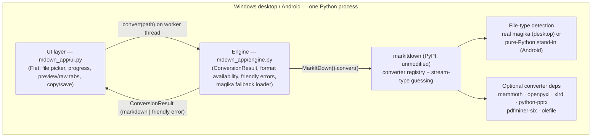
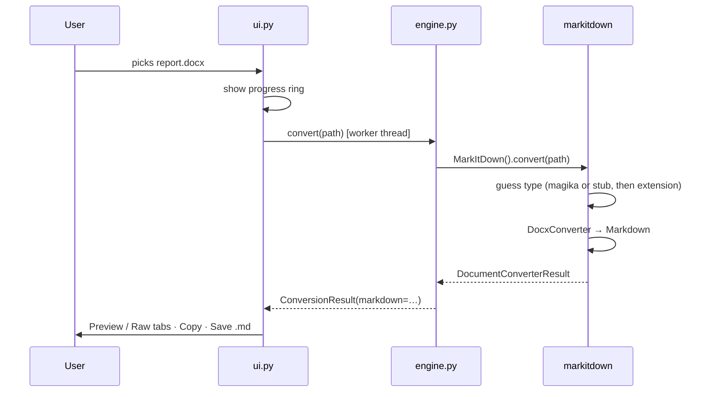

# MDown — Architecture

MDown is a small cross-platform app (Windows desktop + Android) that wraps
[Microsoft MarkItDown](https://github.com/microsoft/markitdown) in a simple
UI: pick a file, get Markdown, preview it, copy or save it. Everything runs
on-device; nothing is uploaded.

This document is the project's map: the framework decision, the system
architecture, the one hard platform constraint and how it is solved, and
where agents fit in.

## 1. Framework decision

The requirements were: one simple UI, Windows **and** Android, and it must
*incorporate* MarkItDown — which is a **Python** library. That last point
dominates the decision: whatever renders the UI, a Python interpreter has
to run next to it (or the conversion has to move to a server, which we
rejected — documents are private, and offline use matters).

| Option | Windows | Android | MarkItDown integration | Verdict |
|---|---|---|---|---|
| **Flet (chosen)** — Python app rendered by Flutter | `flet build windows` | `flet build apk` (bundles Python via serious_python) | in-process `import markitdown` | ✅ One small Python codebase; UI and converter share a process |
| Flutter (Dart) + embedded Python | good | Chaquopy/serious_python glue | FFI/channel bridge to Python | Two languages, a bridge layer, and the same Python-on-Android problems — more moving parts for the same result |
| React Native / MAUI + conversion server | good | good | REST call to a hosted MarkItDown | Violates offline/privacy goals; adds infra to operate |
| Kivy / BeeWare | ok | python-for-android | in-process | Same architecture as Flet but with a dated widget set and more build friction |

Flet wins because the whole app stays in one Python process on both
platforms: the UI calls the converter as a function call, errors are plain
exceptions, and there is exactly one codebase to test. Flet is pinned to
the **0.28.x** stable line; the 0.80+/1.0 API is a breaking rewrite and
migrating is a deliberate, separate task.

## 2. System map



Layering rule: **UI never imports markitdown; the engine never imports
flet.** The engine is plain Python, which is why the test suite runs
headless and why the same engine could later back a CLI or a share-sheet
target unchanged.

## 3. Repository map

```
MDown-App/
├── main.py                     # Flet entry point (flet run / flet build)
├── mdown_app/
│   ├── engine.py               # conversion engine (no UI imports)
│   └── ui.py                   # all Flet UI (no markitdown imports)
├── packaging/magika-stub/      # installable pure-Python magika stand-in
│   └── src/magika/__init__.py  #   (same name+version as real magika)
├── scripts/build_android.py    # APK build with pure-Python dependency set
├── requirements-android.txt    # that dependency set, documented
├── tests/                      # engine + stub tests, incl. Android sim
├── docs/                       # this file, BUILDING.md
└── .github/workflows/ci.yml    # desktop + Android-sim test matrix
```

## 4. The platform constraint, and how it's solved

MarkItDown hard-depends on `magika` (Google's ML file-type detector),
which depends on **onnxruntime** — a native library with no Android wheels
on PyPI. This is the only thing standing between MarkItDown and Android,
and it's solved at two independent levels:

1. **Install time** — `packaging/magika-stub` is a local package whose
   distribution name and version (`magika 0.6.1`) satisfy markitdown's
   requirement, so pip never tries to fetch the real magika/onnxruntime.
   It implements the slice of the magika API markitdown calls
   (`Magika().identify_stream(...)`) using magic-byte signatures
   (PDF/zip-container/OOXML/HTML/text detection) instead of a neural net.
2. **Run time** — `engine._ensure_magika()` makes `import markitdown`
   succeed even if no magika at all is installed, by loading the stub from
   the repo (dev checkouts) or registering a minimal always-"unknown"
   module (last resort).

Why this is safe: when magika answers "unknown", markitdown falls back to
**filename-extension and mimetype guessing** (see
`_get_stream_info_guesses` in markitdown). In this app every file arrives
through a file picker, so an extension is always present — detection
quality degrades gracefully, correctness doesn't.



### Format support by platform

| Format | Windows | Android | Needs |
|---|---|---|---|
| txt, md, html, csv, json, xml, ipynb, epub, zip | ✅ | ✅ | nothing (pure Python) |
| docx | ✅ | ✅ | mammoth (pure) |
| xlsx / xls | ✅ | ✅ | openpyxl / xlrd (pure) |
| pptx | ✅ | ⚠️ | python-pptx needs **lxml** (native) — enabled if Flet's Android wheel index carries it |
| pdf | ✅ | ⚠️ | pdfminer-six needs **cryptography** (native) — same condition |
| msg (Outlook) | ✅ | ✅ | olefile (pure) |

The UI reads this matrix at runtime (`Engine.formats()` probes imports)
and greys out unavailable formats, so the app never promises a conversion
it can't do on the current device.

## 5. UI design

Two views, one file: `mdown_app/ui.py`.

- **Home** — one primary action ("Choose files"), a one-line privacy note,
  and chips showing exactly which formats work on this device.
- **Result** — Preview tab (rendered Markdown) / Markdown tab (raw,
  selectable), plus Copy and Save. Multiple files get a tappable result
  list in between.

Rules kept deliberately: one primary action per screen, conversion always
off the UI thread, every failure surfaces as a sentence a non-developer
can act on (`engine._friendly_error`), light/dark follows the system with
a manual toggle.

## 6. Agents

Two distinct senses, both intentional:

**Development agents (how this repo is built and maintained).** The work
splits cleanly along the architecture seams, so independent agents can own:
- *Engine agent* — `mdown_app/engine.py`, `packaging/magika-stub`, tests;
  guards the "no flet imports" rule.
- *UI agent* — `mdown_app/ui.py`; guards the "no markitdown imports" rule.
- *Build/release agent* — `scripts/`, CI, `flet build` targets.
- *QA agent* — reviews diffs against this document and runs the suite,
  including the Android-simulation job (stub instead of real magika).

The layering rules above are what make this parallelism safe: the
`ConversionResult` dataclass is the only contract the engine and UI agents
share.

**In-app AI agent hook (roadmap, off by default).** MarkItDown accepts an
`llm_client`/`llm_model` to describe images inside documents. The engine
is the single place such a client would be injected (a `MarkItDown(...)`
constructor argument), keeping the UI unchanged apart from a settings
switch. This stays opt-in because it sends document content to an API —
breaking the "nothing leaves the device" default — so it must be an
explicit user choice.

## 7. Roadmap

1. Share-sheet target on Android ("Open with MDown") — engine unchanged.
2. Batch export (save all results as a folder of .md files).
3. Optional LLM image description (see above), behind a settings screen.
4. Flet 1.0 API migration once it stabilizes.
5. URL input (markitdown converts Wikipedia/YouTube/RSS URLs) — needs a
   network-permission story on Android first.
